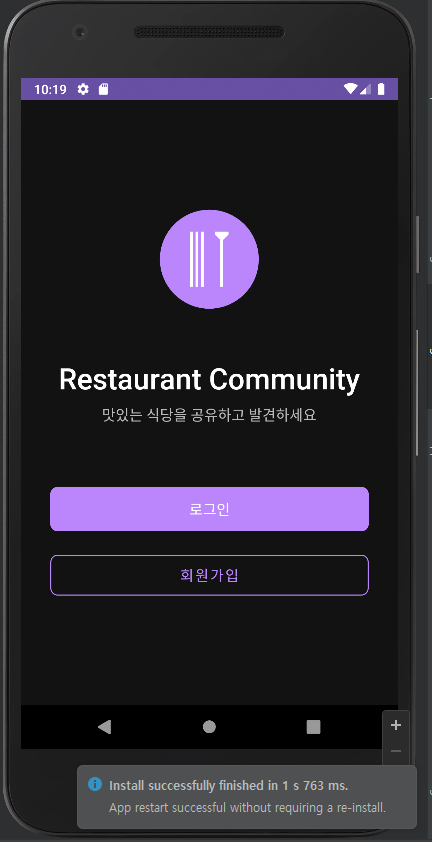
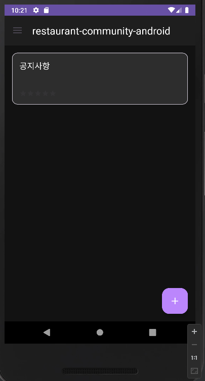
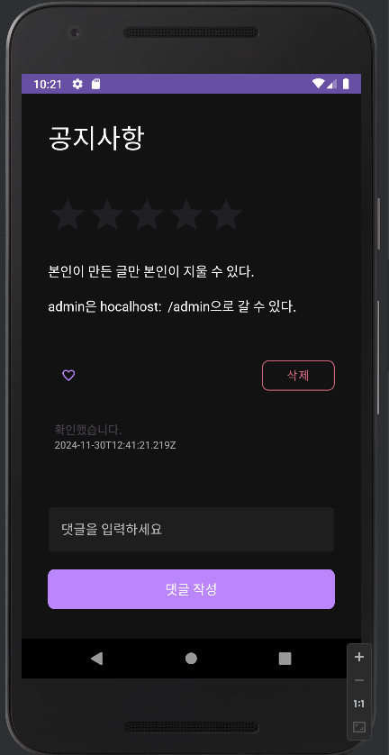
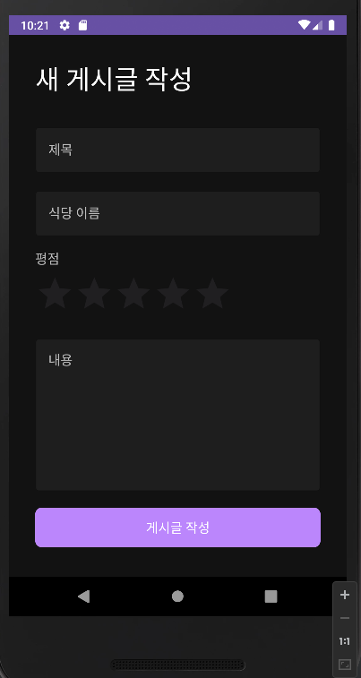
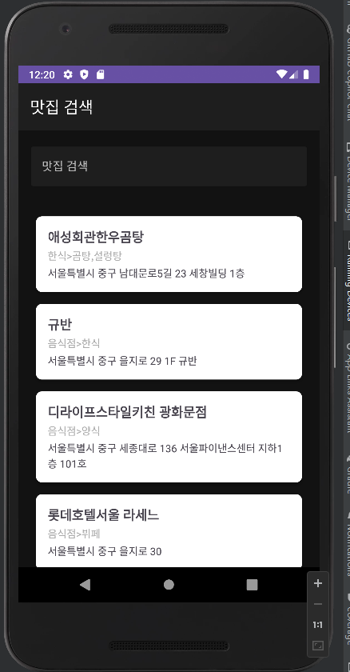
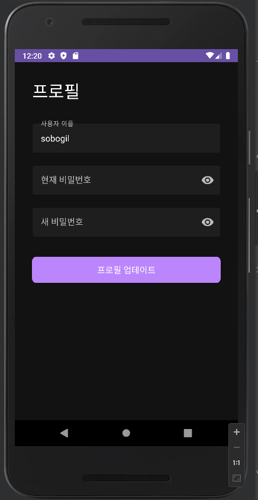

# 맛집 커뮤니티 안드로이드 앱

## 프로젝트 소개
맛집 커뮤니티 앱은 사용자들이 맛집 정보를 공유하고 소통할 수 있는 플랫폼입니다. 해당 프로젝트는 프론트만 구현되어 있습니다. 
백엔드 구현은 아래 링크에서 확인할 수 있습니다.

[백엔드 링크](https://github.com/sobogil/restaurant-recommend-community)

## 주요 기능
- **사용자 관리**
  - 회원가입/로그인
  - 프로필 수정
  - 비밀번호 변경

- **게시글 관리**
  - 게시글 작성/수정/삭제
  - 댓글 작성/삭제
  - 좋아요 기능

- **맛집 검색**
  - 네이버 API 연동
  - 실시간 검색
  - 상세 정보 확인

## 기술 스택
- **Frontend**
  - Android (Java)
  - Material Design Components
  - RecyclerView
  - ViewPager2
  - Navigation Drawer

- **Network**
  - Retrofit2
  - OkHttp3
  - JWT 인증

## 프로젝트 구조

app/  
├── java/  
│ └── com.example.restaurant_community_android/  
│ ├── adapters/  
│ ├── models/  
│ ├── network/  
│ └── utils/  
└── res/ 

## 주요 화면

### 1. 메인 화면

- 앱 로고와 소개 문구
- 로그인/회원가입 버튼

### 2. 게시글 목록

- 게시글 목록 표시
- 플로팅 작성 버튼
- 네비게이션 드로어

### 3. 게시글 상세

- 게시글 내용
- 댓글 시스템
- 좋아요 기능

### 4. 게시글 작성

- 제목 입력
- 식당 이름 입력
- 내용 작성

### 5. 맛집 검색

- 실시간 검색
- 검색 결과 목록
- 상세 정보 표시

### 6. 프로필

- 사용자 정보 표시
- 프로필 수정
- 비밀번호 변경

